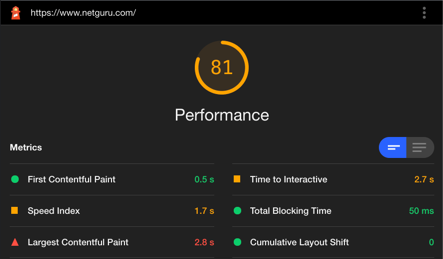
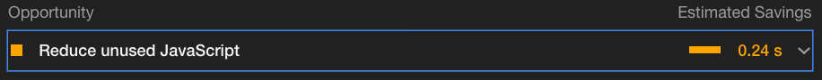

# #RFC-001 Improvement of a web page performance

#### Author: Adam Klepacz
#### Start date: 13/11/2021
#### Deadline: 24/11/2021
#### Status: Review

## Summary (WHAT?)
We need to improve the web page performance because our web page
is performing bad in terms of First Contentful Paint, Speed Index and Time to Interactive metrics.

## Motivation (WHY?)
According to conducted research, web page performance is a crucial factor of user experience on every website. This means that because our web page performance metrics is low, we're losing the conversion rate of the visitors that can became our potential customers. Basically, our company is losing money because of the pure web page performance. The desired outcome of improving the performance is a higher conversion rate that will lead to more leads that can be converted into business deals. 

## Proposal (HOW?)
1. We can try to reduce the Javascript bundle size by using the Webpack chunk plugin to chunk the bundle into main and vendor files
Main will contain Javascript written by us while vendor will contain Javascript from third-party vendors (libraries etc.).

2. We should try to fix LCP metric by fixing the movement of cookie consent element appearing on the page after page load.(...) // More in details description

3. We can try to improve the download time of heavy assets that we're using on the webpage by converting the images from jpg to webp format and by converting the video from mp4 to WebM format. On the homepage there is a "Take a look behind the scenes" video presenting how we work in our company. Currently it's in mp4 format and it takes about 5MB and we can reduce it to 1.2MB by converting from MP4 to WebM format. (...) // More in details description 

TBC...

## Benefits
The main benefit for the company by fixing the company web page performance issue will be a drop in user bounce rate which means that the user visiting our page will be more likely to stay on the page rather than close the page and look for somewhere else. Because the page will be super-fast the user experience will be very good and this will cause the bounce rate to drop. As a result, the company will get more inbound leads throughout our website and more potential business deals that can bring revenue to our company and help us grow.  We will be able to measure the results of the implemented change by using the Google Analytics software where metrics like user bounce rate, or engagement time are one of the key metrics. We will be also able to detect if the applied changes positively influenced the conversion rate(usage of the contact form to contact our company).

## Risks/challenges 
There is a risk that the company website is already optimized to the limits, and we will not be able to improve the performance metrics without modifying the content of the website. There is a risk that we will need to remove some of the heavy media assets to improve the load time of our website. This should be discussed further with our Growth/Marketing team as the outcome from removing the video from the homepage may cause reduction of engagement time of the user which will negatively affect our SEO ranking. 

The other challenge is the cost of implementation of this RFC. To implemented changes proposed in this document we need to take at least two experienced developers, two seniors or senior + regular with knowledge related to the performance optimization, and it will possibly take about from 8 to 12 man days to implement proposed changes. It will mean that these two persons will be out of commercial project for 1-2 weeks. 

## Other
Useful reads about "Why web performance is crucial?":
- https://neilpatel.com/blog/speed-is-a-killer/
- https://developer.mozilla.org/en-US/docs/Learn/Performance/why_web_performance

